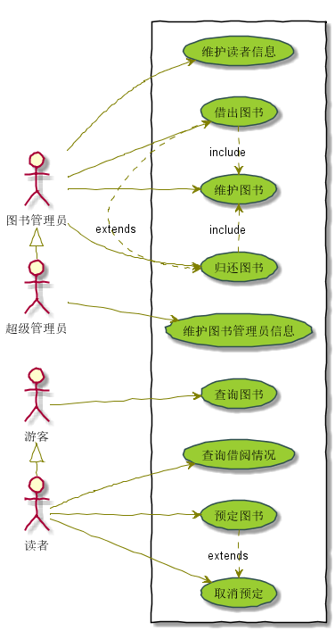

周志强的实验报告
============
##实验二（test2）：图书管理系统用例建模

|学号|班级|姓名|
|:---------------:|:------------:|:------------:|
|201510511129|软件15-1|周志强|

###1.图书管理系统整体的用例关系图

**1.1PlantUML源码如下：**
~~~
@startuml

skinparam packageStyle rectangle

:超级管理员: as root
:图书管理员: as manage
:游客: as visitor
:读者: as reader

reader <|- visitor
root <|- manage
rectangle  {
	left to right direction
	manage -> (维护图书)
	manage --> (借出图书)
	manage -> (归还图书)
	manage -> (维护读者信息)

	root --> (维护图书管理员信息)

	visitor --> (查询图书)

	reader -> (查询借阅情况)
	reader -> (预定图书)
	reader -> (取消预定)

	(借出图书) .> (归还图书) : extends
	(预定图书) .> (取消预定) : extends
	(借出图书) .> (维护图书) : include
	(归还图书) .> (维护图书) : include

}

skinparam handwritten true
skinparam usecase {
	BackgroundColor YellowGreen
	BorderColor DarkSlateGray
	ArrowColor Olive
	ActorBorderColor black
	ActorFontName Courier

}
@enduml
~~~

**1.2用例关系图如下：**

###2.参与者说明
**2.1超级管理员：**

主要职责是：维护图书管理员的身份信息，并拥有图书管理员所有功能。

**2.2图书管理员：**

主要职责是：维护图书，读者信息，负责图书的借还。

**2.3读者**

主要职责是：查询图书，借阅信息，具有预订和取消预订图书功能。

**2.4游客**

主要职责是：只具有查询图书的功能。

###3.用例的规约表

**3.1“查询借阅信息”用例：**

######“查询借阅信息”用例规约

|用例名称|查询借阅信息|
|:-----------:|:-----------------------:|
|参与者|读者|
|前置条件|读者登录到系统|
|后置条件|查询到读者借阅情况|
|主事件流|
|参与者动作|系统行为|
|1.读者输入账号查询| 2.系统确认账号，并返回借阅信息|
|备选事件流|
|1a.账号错误 1.系统提示账号错误，重新输入|
|业务规则|
|1.系统允许多个读者同时查询借阅信息，并对应返回 2.读者只能查询自己的借阅信息|

        