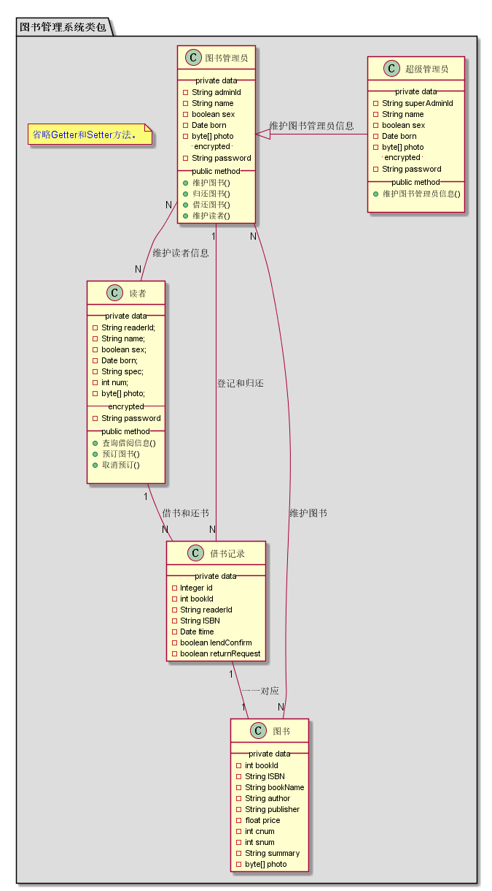
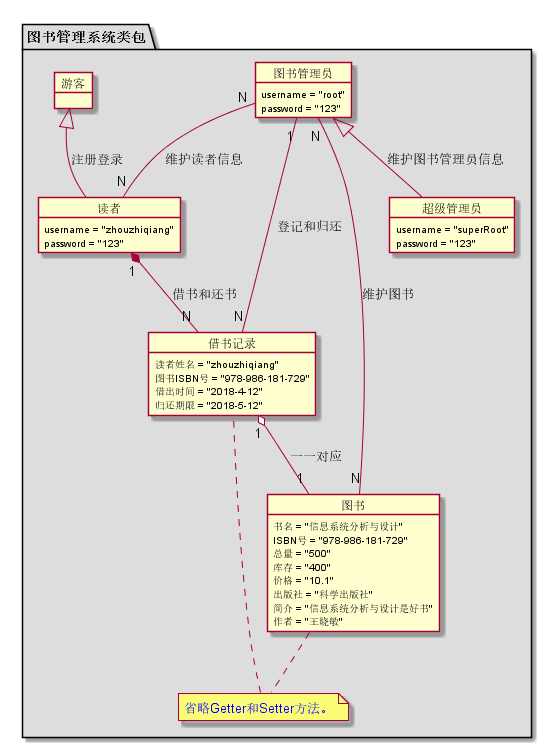
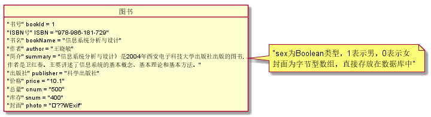
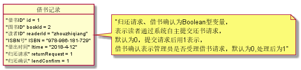
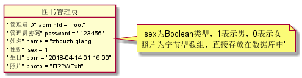
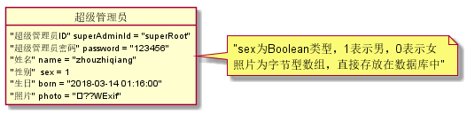
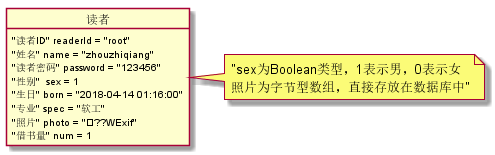

周志强的实验报告
============
## 实验三：图书管理系统领域对象建模

|学号|班级|姓名|
|:---------------:|:------------:|:------------:|
|201510511129|软件15-1|周志强|

### 1.图书管理系统类图

**1.1PlantUML源码如下：**
~~~
@startuml

package "图书管理系统类包" #DDDDDD {
  
	class 图书管理员 {
		 __ private data __
	 	-String username
	 	-- encrypted --
	 	-String password
		 __ public method __
		+维护图书()
		+归还图书()
		+借还图书()
		+维护读者()
		.. Getter and Setter ..
		+ getUsername()
 		+ getPassword()
 		+ setUsername()
 		+ setPassword()
	}
	class 超级管理员 {
		 __ private data __
	 	-String username
	 	-- encrypted --
	 	-String password
		 __ public method __
	 	+维护图书管理员信息()
	 	.. Getter and Setter ..
		+ getUsername()
 		+ getPassword()
 		+ setUsername()
 		+ setPassword()
	}
	class 读者 {
	 	__ private data __
	 	-String username
	 	-- encrypted --
	 	-String password
		 __ public method __
		+查询借阅信息()
		+预订图书()
		+取消预订()
		.. Getter and Setter ..
		+ getUsername()
 		+ getPassword()
 		+ setUsername()
 		+ setPassword()
	}
	class 游客 {
		__ public method __
		+查询图书()
	}

	class 图书 {
		__ private data __
	 	-书名
	 	-ISBN号
	 	-总量
	 	-库存
	 	-价格
	 	-出版社
	 	-简介
	 	-作者
	}

	class 借书记录 {
		__ private data __
	 	-读者姓名
	 	-图书ISBN号
	 	-借出时间
	 	-归还期限
	}

	 note "<color:blue>省略Getter和Setter方法。</color>" as note1

	图书 .. note1
	note1 .. 借书记录

	图书管理员 <|-- 超级管理员 : 维护图书管理员信息
	游客 <|-- 读者 : 注册登录
	读者 "1" *-- "N" 借书记录 : 借书和还书
	借书记录 "1" o-- "1" 图书 : 一一对应
	借书记录 "N" -- "1" 图书管理员 : 登记和归还
	图书管理员 "N" -- "N" 图书 : 维护图书
	图书管理员 "N" -- "N" 读者 : 维护读者信息

  
}

@enduml
~~~
**1.2类图如下：**

### 2.图书管理系统对象图

**2.1图书管理系统对象关系图**

**2.1.1PlantUML源码如下：**
~~~
@startuml

package "图书管理系统类包" #DDDDDD {
  
	object 图书管理员 {
		 username = "root"
		 password = "123"
	}
	object 超级管理员 {
		 username = "superRoot"
		 password = "123"
	}
	
	
	object 读者 {
	 	username = "zhouzhiqiang"
		password = "123"
	}
	object 游客 {
		
	}

	object 图书 {
	 	书名 = "信息系统分析与设计"
	 	ISBN号 = "978-986-181-729"
	 	总量 = "500"
	 	库存 = "400"
	 	价格 = "10.1"
	 	出版社 = "科学出版社"
	 	简介 = "信息系统分析与设计是好书"
	 	作者 = "王晓敏"
	}

	object 借书记录 {
	 	读者姓名 = "zhouzhiqiang"
	 	图书ISBN号 = "978-986-181-729"
	 	借出时间 = "2018-4-12"
	 	归还期限 = "2018-5-12"
	}

	note "<color:blue>省略Getter和Setter方法。</color>" as note1

	图书 .. note1
	note1 .. 借书记录

	图书管理员 <|-- 超级管理员 : 维护图书管理员信息
	游客 <|-- 读者 : 注册登录
	读者 "1" *-- "N" 借书记录 : 借书和还书
	借书记录 "1" o-- "1" 图书 : 一一对应
	借书记录 "N" -- "1" 图书管理员 : 登记和归还
	图书管理员 "N" -- "N" 图书 : 维护图书
	图书管理员 "N" -- "N" 读者 : 维护读者信息

  
}

@enduml
~~~

**2.1.2对象图如下：**

**2.2类图书对象图**

**2.2.1PlantUML源码如下：**
~~~
@startuml

object 图书 {
	 	书名 = "信息系统分析与设计"
	 	ISBN号 = "978-986-181-729"
	 	总量 = "500"
	 	库存 = "400"
	 	价格 = "10.1"
	 	出版社 = "科学出版社"
	 	简介 = "信息系统分析与设计是好书"
	 	作者 = "王晓敏"
}

@enduml
~~~

**2.2.2对象图如下：**

**2.3类借书记录对象图**

**2.3.1PlantUML源码如下：**
~~~
@startuml

object 借书记录 {
	 	读者姓名 = "zhouzhiqiang"
	 	图书ISBN号 = "978-986-181-729"
	 	借出时间 = "2018-4-12"
	 	归还期限 = "2018-5-12"
}

@enduml
~~~

**2.3.2对象图如下：**

**2.4类图书管理员对象图**

**2.4.1PlantUML源码如下：**
~~~
@startuml

object 图书管理员 {
		 username = "root"
		 password = "123"
}

@enduml
~~~

**2.4.2对象图如下：**

**2.5类超级管理员对象图**

**2.5.1PlantUML源码如下：**
~~~
@startuml

object 超级管理员 {
		 username = "superRoot"
		 password = "123"
}

@enduml
~~~

**2.5.2对象图如下：**

**2.6类读者对象图**

**2.6.1PlantUML源码如下：**
~~~
@startuml

object 读者 {
	 	username = "zhouzhiqiang"
		password = "123"
}

@enduml
~~~

**2.6.2对象图如下：**

**2.7类读者对象图**

**2.7.1PlantUML源码如下：**
~~~
@startuml

object 游客 {
		
	}

@enduml
~~~

**2.7.2对象图如下：**

