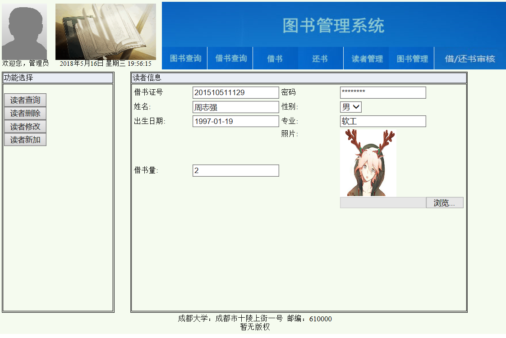

周志强的实验报告
============
## 实验五：图书管理系统数据库设计与界面设计

|学号|班级|姓名|
|:---------------:|:------------:|:------------:|
|201510511129|软件15-1|周志强|

### 1.表数据库设计

**1.1 图书表**

|字段|类型|主键，外键|可以为空|约束|说明|
|:-------:|:-------------:|:------:|:----:|:---:|:-----|    
|bookId|int(100)|主键|否||图书ID|  
|ISBN|varchar(100)||否|唯一，只包含数字和"-"|图书ISBN号|  
|bookName|varchar(100)||否||图书名称|
|author|varchar(100)||否|汉字或字母|图书作者|  
|publisher|varchar(100)||否|汉字或字母|图书出版社|
|price|float(100)||否||图书购入单价|  
|cnum|int(100)||否||图书馆总计购入数量|  
|snum|int(100)||否||图书馆剩余库存| 
|summary|varchar(100)||是||图书简介|
|photo|varbinary(60000)||是||图书封面|

**1.2 读者表**

|字段|类型|主键，外键|可以为空|约束|说明|
|:-------:|:-------------:|:------:|:----:|:---:|:-----|    
|readerId|varchar(100)|主键|否||读者ID|
|name|varchar(100)||否|汉字或字母|读者姓名|
|password|varchar(100)||否||读者密码，需加密| 
|sex|bit(1)||否|1表示男，0表示女|读者性别| 
|born|datetime||否|不能超过当前日期|读者生日| 
|spec|varchar(100)||否|汉字或字母|读者所在专业|  
|spec|varchar(100)||否|汉字或字母|读者所在专业| 
|num|(100)||否|初始值为0|读者借书数量| 
|photo|varbinary(60000)||是||读者照片| 

**1.3 图书管理员表**

|字段|类型|主键，外键|可以为空|约束|说明|
|:-------:|:-------------:|:------:|:----:|:---:|:-----|    
|adminId|varchar(100)|主键|否||图书管理员ID|
|name|varchar(100)| |否||图书管理员姓名|  
|password|varchar(100)| |否||图书管理员密码，需加密|
|sex|bit(1)||否|1表示男，0表示女|图书管理员性别| 
|born|datetime||否|不能超过当前日期|图书管理员生日|  
|photo|varbinary(60000)||是||图书管理员照片|  


**1.3 超级管理员表**

|字段|类型|主键，外键|可以为空|约束|说明|
|:-------:|:-------------:|:------:|:----:|:---:|:-----|    
|superAdminId|varchar(100)|主键|否||超级管理员ID|
|name|varchar(100)| |否||超级管理员姓名|  
|password|varchar(100)| |否||超级管理员密码，需加密|
|sex|bit(1)||否|1表示男，0表示女|超级管理员性别| 
|born|datetime||否|不能超过当前日期|超级管理员生日|  
|photo|varbinary(60000)||是||超级管理员照片|  


**1.4 借书表**

|字段|类型|主键，外键|可以为空|约束|说明|
|:-------:|:-------------:|:------:|:----:|:---:|:-----|    
|id|int(100)|主键|否|数据库自动生成|借书记录ID|
|readerId|varchar(100)|外键|否||读者ID|  
|bookId|int(100)|外键|否||图书ID|  
|ISBN|varchar(100)||否|唯一，只包含数字和"-"|图书ISBN号| 
|ltime|datetime||否|不能超过当前日期|借书时间|  
|returnRequest|bit(1)||否|默认为0，提交请求后用1表示|表示读者通过系统自主提交还书请求| 
|lendConfirm|bit(1)||否|默认为0,处理后为1|借书确认表示图书管理员是否受理借书请求| 

 

## 2. 界面设计
**2.1 读者管理界面设计**

- 用例图参见：读者管理设计用例
- 类图参见：读者类
- 顺序图参见：读者管理设计顺序图
- API接口如下：

1. 读者查询

- 功能：用于获取指定读者
- 请求地址： http://localhost:8080/LibrarySystem/GET/readers/xxx
- 请求方法：GET
- 请求参数：readerId(String)

|参数名称|必填|说明|
|:-------:|:-------------: | :----------:|
|readerId|是|用于指定查询的读者 |
|method|是|固定为 “POST”|

- 请求实例：
```
    http://localhost:8080/LibrarySystem/GET/readers/201510511129
```
- 返回实例：
```
{
    "code": 200,
    "data": {
             readerId = "root"
     	     name = "zhouzhiqiang"
    	     sex = 1
    	     born = "2018-04-14 01:16:00"
    	     spec = "软工"
    	     photo = "??WExif"
    	     num = 1
     },
    "msg": "响应成功"
}
```
- 返回参数说明：
    
|参数名称|说明|
|:-------:|:-------------: |
|msg|请求响应结果|
|data|读者的个人信息|
|code|返回码，用于判断请求是否被响应|
/注：因为密码为加密数据且无需使用，不需返回\n照片不为必填项，数据库中若无则返回"",其余参数均不能为空/

2. 读者删除

- 功能：用于删除指定读者
- 请求地址： http://localhost:8080/LibrarySystem/DELETE/readers/xxx
- 请求方法：GET
- 请求参数：readerId(String)

|参数名称|必填|说明|
|:-------:|:-------------: | :----------:|
|readerId|是|用于指定删除的读者 |
|method|是|固定为 “POST”|

- 请求实例：
```
    http://localhost:8080/LibrarySystem/DELETE/readers/201510511129
```
- 返回实例：
```
{
    "code": 200,
    "data": {
            "flag":true,
     },
    "msg": "响应成功"
}
```
- 返回参数说明：
    
|参数名称|说明|
|:-------:|:-------------: |
|msg|请求响应结果|
|data|返回的主体信息|
|code|返回码，用于判断请求是否被响应|
|flag|读者是否删除成功|

3. 读者修改

- 功能：用于修改指定读者
- 请求地址： http://localhost:8080/LibrarySystem/PATCH/readers/xxx
- 请求方法：POST
- 请求参数：Json格式的Reader对象（注：可修改密码，存储前系统会进行加密）

|参数名称|必填|说明|
|:-------:|:-------------: | :----------:|
|Reader|是|读者类对象 |
|method|是|固定为 “POST”。|

- 请求实例：
```
请求地址：http://localhost:8080/LibrarySystem/PATCH/readers/201510511129
参数格式：
Content-Type: application/json
 {
     readerId = "root"
     name = "zhouzhiqiang"
     password = "123456"
     sex = 1
     born = "2018-04-14 01:16:00"
     spec = "软工"
     photo = "??WExif"
     num = 1
 }

```
- 返回实例：
```
{
    "code": 200,
    "data": {
             readerId = "root"
     	     name = "zhouzhiqiang"
    	     sex = 1
    	     born = "2018-04-14 01:16:00"
    	     spec = "软工"
    	     photo = "??WExif"
    	     num = 1
            "flag":true,
     },
    "msg": "响应成功"
}
```
- 返回参数说明：
    
|参数名称|说明|
|:-------:|:-------------: |
|msg|请求响应结果|
|data|返回的主体信息，读者类对象+flag参数|
|code|，返回码，用于判断请求是否被响应|
|flag|读者是否修改成功|
/注：返回的data中不包含密码/

4. 读者新加

- 功能：用于添加读者
- 请求地址： http://localhost:8080/LibrarySystem/POST/reader
- 请求方法：POST
- 请求参数：Json格式的Reader对象（注：必需设置密码，存储前系统会进行加密）

|参数名称|必填|说明|
|:-------:|:-------------: | :----------:|
|Reader|是|读者类对象 |
|method|是|固定为 “POST”。|

- 请求实例：
```
请求地址：http://localhost:8080/LibrarySystem/POST/reader
参数格式：
Content-Type: application/json
 {
     readerId = "root"
     name = "zhouzhiqiang"
     password = "123456"
     sex = 1
     born = "2018-04-14 01:16:00"
     spec = "软工"
     photo = "??WExif"
     num = 1
 }

```

- 返回实例：
```
{
    "code": 200,
    "data": {
            "readerId": "201510511129",
            "name": "周志强",
            "sex": 1,
            "born": "1997-01-19 00:00:00",
            "spec": "软工",
            "num": 2,
            "photo": "??WExif",
            "flag":true,
     },
    "msg": "响应成功"
}
```
- 返回参数说明：
    
|参数名称|说明|
|:-------:|:-------------: |
|msg|请求响应结果|
|data|返回的主体信息，读者类对象+flag参数|
|code|，返回码，用于判断请求是否被响应|
|flag|读者是否添加成功|
/注：返回的data中不包含密码/


