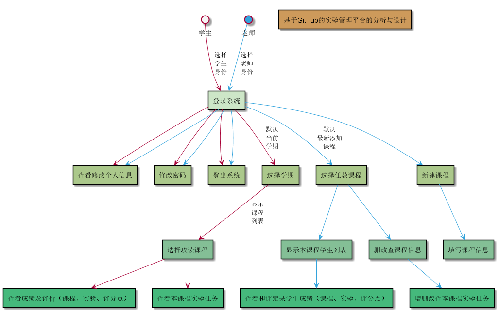
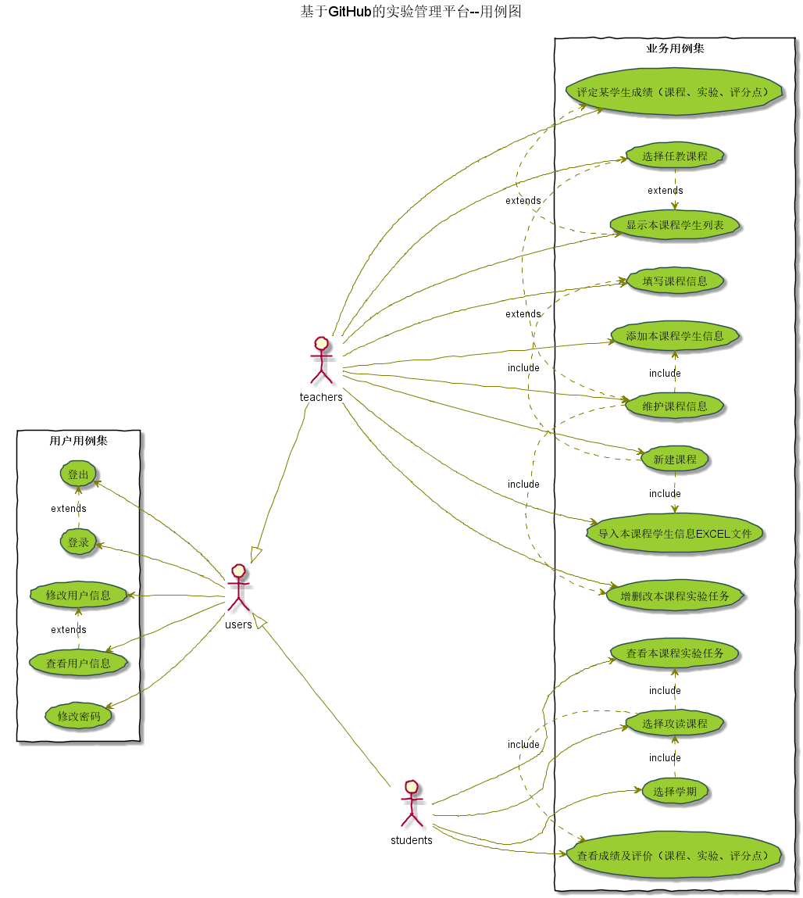
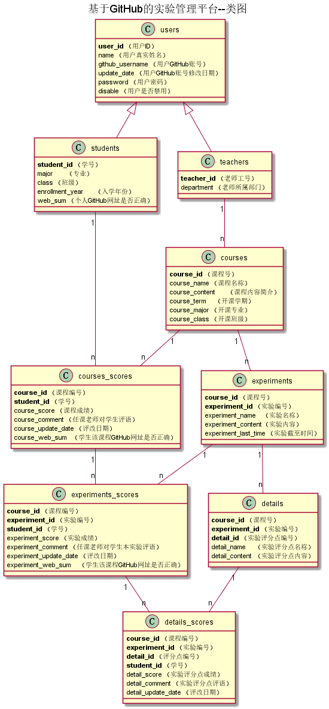

# 基于GitHub的实验管理平台的分析与设计

### 成都大学信息科学与工程学院

#

|学号|班级|姓名|照片|
|:-------:|:-------------: | :----------:|:---:|
|201510511129|软件(本)15-1|周志强||

## 1. 概述
*   基于GitHub的学生成绩管理系统（以下简称本系统），主要功能对于老师是提供评定学生本课程成绩；  
对于学生是查看学生本人各个学期各个课程成绩。其中，本系统用户分为两类人，即老师和学生。系统用户  
都具备的功能是登录、修改老师或学生本人信息（如GitHub账号地址）等功能。而老师具有评定学生本学科  
各个实验成绩(多评分点)、给予实验评价等功能；学生具有查看学生本人所有课程实验成绩及评价等功能。  
    
## 2. 系统总体结构
*   本系统包括用户登录、查看学生列表、修改本人信息、为某个学生评定本课程实验成绩、查看学生本  
人实验成绩及评价等模块。它包含两个子系统，即老师与学生子系统。  
    1.  老师子系统：  
    *   主线1 实验评分：登陆系统->选择某一课程->显示本课程学生列表->评定某学生本课程成绩 
    *   主线2 实验任务：登陆系统->选择某一课程->维护课程信息->增删改本课程实验任务  
    *   主线3 课程及学生信息：登陆系统->新建课程->填写课程信息->导入本课程学生信息EXCEL文件  
    2.  学生子系统：  
    *   主线1 查看实验任务：登陆系统->选择学期->选择课程->查看本课程实验任务  
    *   主线2 查看成绩及评价：登陆系统->选择学期->选择课程->查看本课程实验成绩及评价  
    3.  用户公有系统：   
    *   主线1 维护个人信息：登录系统->修改个人信息
    *   主线2 登出系统：登录系统->登出系统   
*   子系统结构区分了老师和学生的权限，从而不仅保证了学生成绩的有效性，还保护了学生  
的隐私。
*   具体结构见系统结构图:  
**系统结构图 [源码](./src/codes/strut.wsd)**

    
## 3. 用例图设计[源码](./src/codes/usecase.wsd)

## 4. 类图设计[源码](./src/codes/class.wsd)

## 5. 数据库设计
- ### [参见数据库设计](./src/数据库设计/数据库设计.md)
     
## 6. 界面及用例详细设计

### [“登录”用例](./src/用例/登录.md),[界面](https://agreysky.github.io/is_analysis/test6/ui/login.html)
### [“登出”用例](./src/用例/登出.md),[界面](https://agreysky.github.io/is_analysis/test6/ui/顶部菜单_html.html)
### [“修改密码”用例](./src/用例/修改密码.md),[界面](https://agreysky.github.io/is_analysis/test6/ui/顶部菜单_html.html)
### [“查看个人信息”用例](./src/用例/查看个人信息.md),[界面](https://agreysky.github.io/is_analysis/test6/ui/顶部菜单_html.html)
### [“修改个人信息”用例](./src/用例/修改个人信息.md),[界面](https://agreysky.github.io/is_analysis/test6/ui/顶部菜单_html.html)
### [“选择学期”用例](./src/用例/选择学期.md),[界面](https://agreysky.github.io/is_analysis/test6/ui/选择学期_html.html)
### [“显示课程列表”用例](src/用例/查看课程列表.md),[界面](https://agreysky.github.io/is_analysis/test6/ui/查看课程列表_html.html)
### [“查看课程信息”用例](./src/用例/查看课程信息.md),[界面](https://agreysky.github.io/is_analysis/test6/ui/查看课程信息_html.html)
### [“查看本课程实验任务”用例](src/用例/查看实验列表.md),[界面](https://agreysky.github.io/is_analysis/test6/ui/删改查实验任务（1）_html.html)
### [“查看成绩及评价”用例](src/用例/查看成绩列表.md),[界面](https://agreysky.github.io/is_analysis/test6/ui/查看和评定成绩列表_html.html)
### [“选择任教课程”用例](./src/用例/选择任教课程.md),[界面](https://agreysky.github.io/is_analysis/test6/ui/顶部菜单_html.html)
### [“显示本课程学生列表”用例](./src/用例/显示本课程学生列表.md),[界面](https://agreysky.github.io/is_analysis/test6/ui/显示本课程学生列表_html.html)
### [“评定某学生成绩”用例](./src/用例/评定某学生成绩.md),[界面](https://agreysky.github.io/is_analysis/test6/ui/查看和评定成绩列表_html.html)
### [“新增实验信息”用例](./src/用例/新增实验信息.md),[界面](https://agreysky.github.io/is_analysis/test6/ui/新增实验信息_html.html)
### [“修改实验信息”用例](./src/用例/修改实验信息.md),[界面](https://agreysky.github.io/is_analysis/test6/ui/删改查实验任务（1）_html.html)
### [“删除实验信息”用例](./src/用例/删除实验信息.md),[界面](https://agreysky.github.io/is_analysis/test6/ui/删改查实验任务（1）_html.html)
### [“修改课程信息”用例](./src/用例/修改课程信息.md),[界面](https://agreysky.github.io/is_analysis/test6/ui/修改课程信息_html.html)
### [“新建课程”用例](./src/用例/新建课程.md),[界面](https://agreysky.github.io/is_analysis/test6/ui/新建课程_html.html)
### [“删除课程信息”用例](./src/用例/删除课程信息.md),[界面](https://agreysky.github.io/is_analysis/test6/ui/顶部菜单_html.html)

## 7. 参考文献
- 绘制方法参考[PlantUML标准](http://plantuml.com)
- Markdown格式参考：https://www.jianshu.com/p/b03a8d7b1719