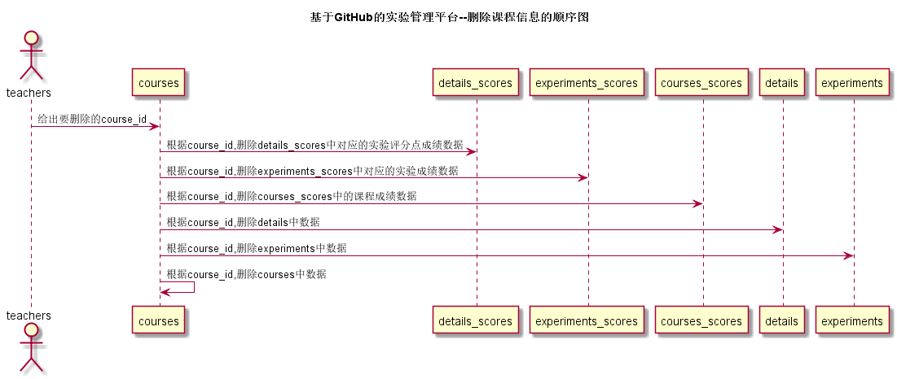
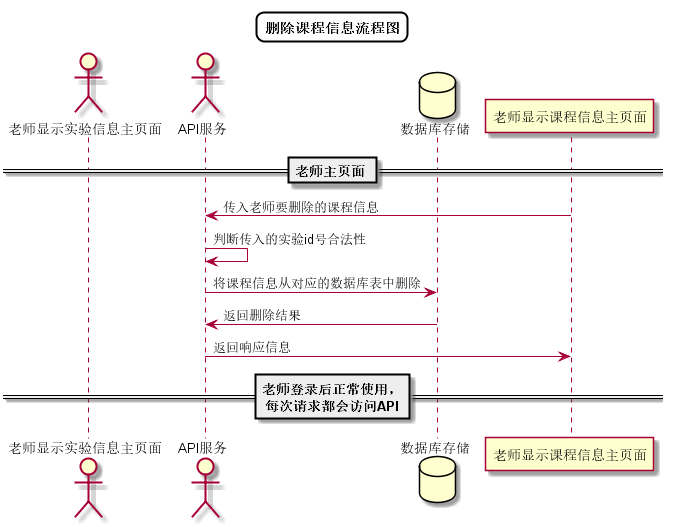

# “删除课程信息”用例 [返回](../../README.md)

## 1. 用例规约

|用例名称|删除课程信息|
|-------|:-------------|
|功能|删除某个课程全部信息|
|参与者|老师|
|前置条件| 以老师的身份登录成功，能访问该课程|
|后置条件||
|主事件流| 1. 老师从课程列表中选择删除某个课程全部信息|
|备选事件流||

## 2. 业务流程（顺序图） [源码](../顺序图/删除课程信息.wsd)
 

## 3. 界面设计
- 界面参照: https://aGreySky.github.io/is_analysis/test6/src/ui/顶部菜单.html
- API接口调用
    - 接口1：[deleteCourse](../接口/deleteCourse.md)

## 4. 算法描述 [源码](../流程图/删除课程信息流程图.wsd)

    
## 5. 参照表

- [EXPERIMENTS](../数据库设计/数据库设计.md/#EXPERIMENTS)
- [COURSES](../数据库设计/数据库设计.md/#COURSES)
- [DETAILS](../数据库设计/数据库设计.md/#DETAILS)
- [DETAILS_SCORES](../数据库设计/数据库设计.md/#DETAILS_SCORES)
- [COURSES_SCORES](../数据库设计/数据库设计.md/#COURSES_SCORES)
- [EXPERIMENTS_SCORES](../数据库设计/数据库设计.md/#EXPERIMENTS_SCORES)
