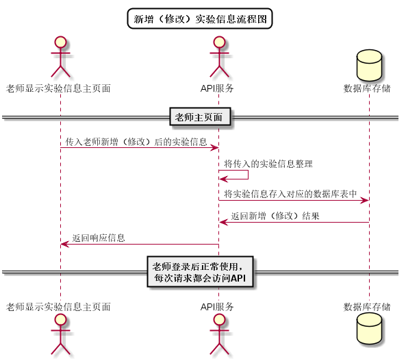

# “新增实验信息”用例 [返回](../../README.md)

## 1. 用例规约

|用例名称|新增实验信息|
|-------|:-------------|
|功能|新增实验的信息|
|参与者|老师|
|前置条件| 以老师的身份登录成功，能访问该课程|
|后置条件||
|主事件流| 1. 老师点击新增实验按钮 2.老师输入实验信息并确认|
|备选事件流|1a. 老师误输入不合法实验信息  &nbsp;&nbsp; 1.系统提示信息输入错误  &nbsp;&nbsp; 2.老师重新输入信息|

## 2. 业务流程
无

## 3. 界面设计
- 界面参照: https://aGreySky.github.io/is_analysis/test6/src/src/ui/新增实验信息_html.html
- API接口调用
    - 接口1：[setExperiment](../接口/setExperiment.md)

## 4. 算法描述 [源码](../流程图/新增（修改）实验信息流程图.wsd)

    
## 5. 参照表

- [EXPERIMENTS](../数据库设计/数据库设计.md/#EXPERIMENTS)