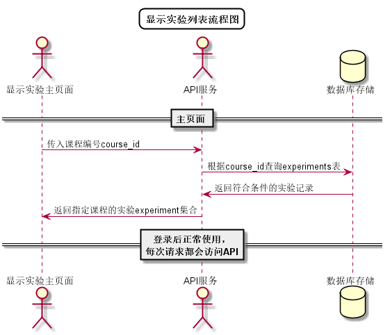

# “查看本课程实验任务”用例 [返回](../../README.md)

## 1. 用例规约

|用例名称|查看本课程实验任务|
|-------|:-------------|
|功能|学生/老师查看指定课程实验任务的信息|
|参与者|学生/老师|
|前置条件| 登录成功，能访问该课程|
|后置条件||
|主事件流| 1. 用户点击查看实验任务按钮 2.系统根据课程号查询并返回实验任务信息 |
|备选事件流|1a. 如果该课程无实验未发布实验任务  &nbsp;&nbsp; 1.本课程暂无实验任务|

## 2. 业务流程
无

## 3. 界面设计
- 界面参照: https://aGreySky.github.io/is_analysis/test6/src/ui/删改查实验任务（1）_html.html
- API接口调用
    - 接口1：[getExperimentList](../接口/getExperiments.md)

## 4. 算法描述 [源码](../流程图/显示实验列表流程图.wsd)

    
## 5. 参照表

- [COURSES](../数据库设计/数据库设计.md/#COURSES)