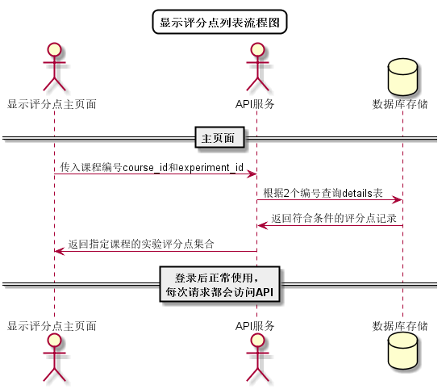

# “查看实验评分点”用例 [返回](../../README.md)

## 1. 用例规约

|用例名称|查看实验评分点|
|-------|:-------------|
|功能|学生/老师查看指定课程的实验评分点的信息|
|参与者|学生/老师|
|前置条件| 登录成功，能访问该课程|
|后置条件||
|主事件流| 1. 用户点击实验评分点按钮 2.系统根据课程号和实验号查询并返回评分点信息 |
|备选事件流|1a. 如果该实验未发布评分点信息  &nbsp;&nbsp; 1.本实验暂无评分点信息|

## 2. 业务流程
无

## 3. 界面设计
- 界面参照: https://aGreySky.github.io/is_analysis/test6/src/ui/删改查实验评分点_html.html
- API接口调用
    - 接口1：[getDetails](../接口/getDetails.md)

## 4. 算法描述 [源码](../流程图/查看实验评分点流程图.wsd)

    
## 5. 参照表

- [DETAILS](../数据库设计/数据库设计.md/#DETAILS)