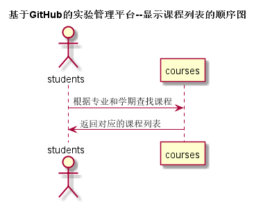
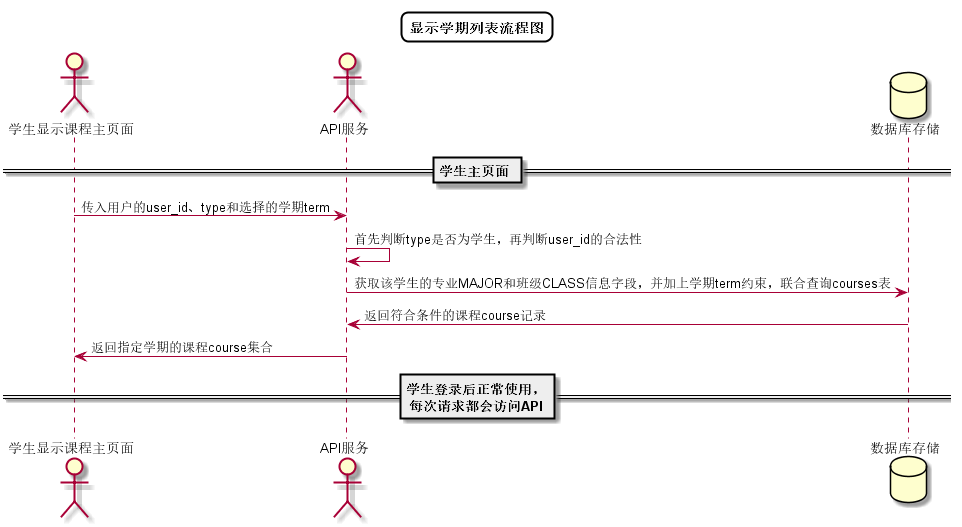

# “显示课程列表”用例 [返回](../../README.md)

## 1. 用例规约

|用例名称|显示课程列表|
|-------|:-------------|
|功能|根据学期和专业显示学生的课程列表|
|参与者|学生|
|前置条件| 以学生的身份登录成功|
|后置条件|所选学期存在所修课程|
|主事件流| 1. 学生选择所修学期 2.系统根据学期名称和学生所在专业查询课程列表 3.返回符合条件的课程列表 |
|备选事件流|1a. 学生无已修或在修课程  &nbsp;&nbsp; 1.提示学生无课程   &nbsp;&nbsp;|

## 2. 业务流程（顺序图） [源码](../顺序图/显示课程列表.wsd)
 

## 3. 界面设计
- 界面参照: https://aGreySky.github.io/is_analysis/test6/src/ui/查看课程列表_html.html
- API接口调用
    - 接口1：[chooseTerm](../接口/getTerms.md)
    - 接口1：[showStudentCourses](../接口/getCourses.md)

## 4. 算法描述 [源码](../流程图/显示课程列表流程图.wsd)

    
## 5. 参照表

- [STUDENTS](../数据库设计/数据库设计.md/#STUDENTS)
- [COURSES](../数据库设计/数据库设计.md/#COURSES)
- [TEACHERS](../数据库设计/数据库设计.md/#TEACHERS)
- [USERS](../数据库设计/数据库设计.md/#USERS)