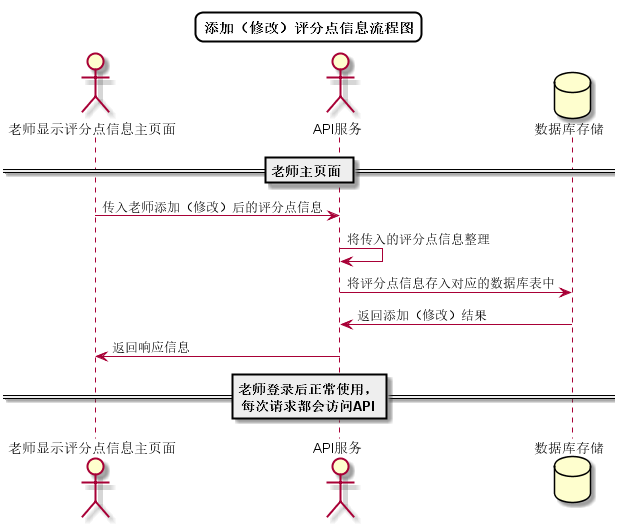

# “添加评分点”用例 [返回](../../README.md)

## 1. 用例规约

|用例名称|添加评分点|
|-------|:-------------|
|功能|添加评分点的信息|
|参与者|老师|
|前置条件| 以老师的身份登录成功，能访问该课程|
|后置条件||
|主事件流| 1. 老师点击添加评分点按钮 2.老师输入评分点信息并确认|
|备选事件流|1a. 老师误输入不合法评分点信息  &nbsp;&nbsp; 1.系统提示信息输入错误  &nbsp;&nbsp; 2.老师重新输入信息|

## 2. 业务流程
无 

## 3. 界面设计
- 界面参照: https://aGreySky.github.io/is_analysis/test6/src/ui/添加评分点_html.html
- API接口调用
    - 接口1：[setDetail](../接口/setDetail.md)

## 4. 算法描述 [源码](../流程图/添加（修改）评分点信息流程图.wsd)

    
## 5. 参照表

- [DETAILS](../数据库设计/数据库设计.md/#DETAILS)