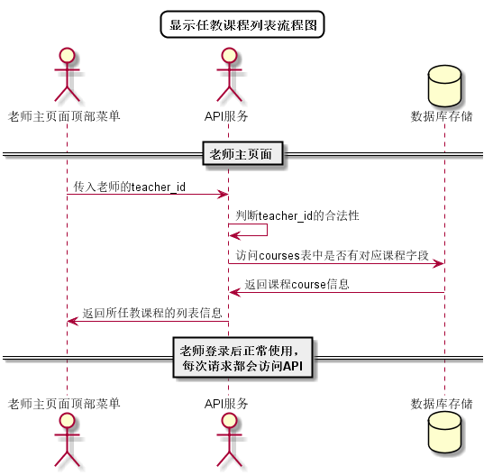

# “选择任教课程”用例 [返回](../../README.md)

## 1. 用例规约

|用例名称|选择任教课程|
|-------|:-------------|
|功能|老师选择所教授课程|
|参与者|老师|
|前置条件| 以老师的身份登录成功|
|后置条件||
|主事件流| 1. 老师点击下拉菜单 2.系统显示老师已创建的课程列表 3.老师选择任意课程|
|备选事件流|1a. 老师无创建课程  &nbsp;&nbsp; 1.下拉菜单无选项   &nbsp;&nbsp;|

## 2. 业务流程
无

## 3. 界面设计
- 界面参照: https://aGreySky.github.io/is_analysis/test6/src/ui/顶部菜单.html
- API接口调用
    - 接口1：[getCourseListByTec](../接口/getCoursesByTec.md)

## 4. 算法描述 [源码](../流程图/显示任教课程列表流程图.wsd)

    
## 5. 参照表

- [COURSES](../数据库设计/数据库设计.md/#COURSES)