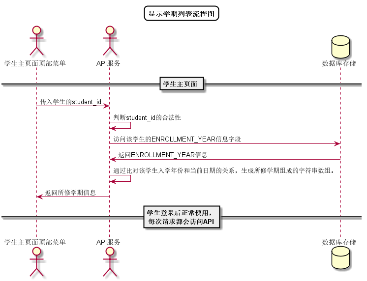

# “选择学期”用例 [返回](../../README.md)

## 1. 用例规约

|用例名称|选择学期|
|-------|:-------------|
|功能|学生选择所修读的学期|
|参与者|学生|
|前置条件| 以学生的身份登录成功|
|后置条件|所选学期存在所修课程|
|主事件流| 1. 学生点击下拉菜单 2.系统显示学生已修的学期列表（包括当前学期） 3.学生选择任意学期|
|备选事件流|1a. 学生无已修或在修课程  &nbsp;&nbsp; 1.下拉菜单无选项   &nbsp;&nbsp;|

## 2. 业务流程
无

## 3. 界面设计
- 界面参照: https://aGreySky.github.io/is_analysis/test6/ui/顶部菜单.html
- API接口调用
    - 接口1：[getTermList](../接口/getTerms.md)

## 4. 算法描述 [源码](../流程图/显示学期列表流程图.wsd)

    
## 5. 参照表

- [STUDENTS](../数据库设计/数据库设计.md/#STUDENTS)